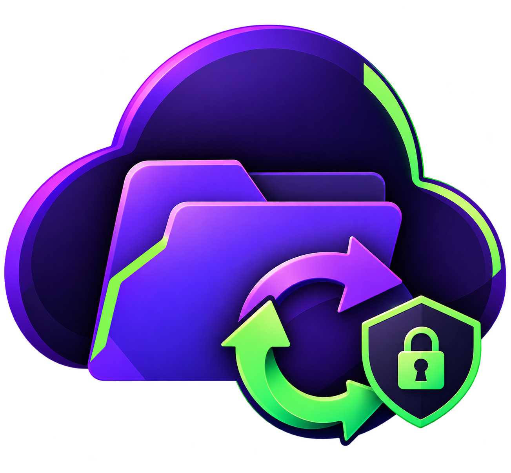

<p align="center">
  
</p>

<h1 align="center">protondrive4linux</h1>

<p align="center">
  Bidirectional folder sync for Proton Drive on Linux, built on Proton's official <code>proton-drive</code> CLI.
</p>

> protondrive4linux is an independent, unofficial project. It is not affiliated with, endorsed by, or sponsored by Proton AG. "Proton" and "Proton Drive" are trademarks of Proton AG. protondrive4linux never sees your Proton credentials; it only drives Proton's own CLI, which you log in yourself.

The official `proton-drive` CLI can upload, download, list, and manage sharing, but it has no sync engine. protondrive4linux adds one: a three-way-merge engine that keeps one or more local folders and their Proton Drive counterparts in sync in both directions, driven entirely by the CLI's one-shot commands. It ships as a dependency-light CLI plus an optional native GUI, both on one core library.

## Features

- **Bidirectional three-way merge.** A per-pair baseline lets it tell "new on the remote" apart from "deleted locally", so changes on either side are applied correctly instead of blindly mirrored.
- **Safe by default.** Deletions are opt-in and recoverable (remote to Proton trash, local to the desktop trash). A missing baseline unions both sides rather than mass-deleting. Conflicts keep both copies. An unmounted local folder or a vanished remote base is refused, not mistaken for a mass delete.
- **Selective sync.** Exclude sub-folders per pair. Excluded paths are never touched on Proton; you can optionally free up local space by removing the local copy while the cloud copy stays.
- **Live sync.** A watch daemon reconciles on local change (inotify, debounced) and does a periodic full rescan to catch everything else, including changes made on your other devices.
- **Native GUI or CLI.** An egui desktop app (single binary, optional system tray) or a lean command-line tool. Same engine, same config.
- **Signed releases.** Commits and tags are GPG-signed; releases ship `.deb`, `.rpm`, and a portable binary tarball.

## Requirements

- Linux with a recent Rust toolchain (edition 2021) if building from source.
- The official `proton-drive` CLI on your `PATH` (<https://proton.me/blog/proton-drive-cli>). Verified against `cli-drive 0.8.0`. Installing via the `PKGBUILD` (Arch/AUR) pulls this in automatically as a dependency (`proton-drive-cli`, `-bin`, or `-git` - three community AUR packages provide it); building from source or installing another way still means getting it yourself.
- `gio` (from glib, present on most desktops) for recoverable local deletes; a manual XDG-trash fallback is used if it is missing.

## Install

### Arch Linux (AUR)

```sh
yay -S protondrive4linux-git   # or paru, or any other AUR helper
```

This pulls in the official `proton-drive` CLI automatically (as `proton-drive-cli`,
its `-bin`, or its `-git` variant — pick whichever your AUR helper offers) along
with every other dependency, so one command leaves you ready to launch the app
and sign in. `protondrive4linux-git` tracks `master`; see
[`PKGBUILD`](PKGBUILD) if you'd rather build it yourself with `makepkg`.

### From a release (Debian/Ubuntu)

```sh
# download the .deb from the Releases page, then:
sudo apt install ./protondrive4linux_<version>_amd64.deb
```

### From a release (Fedora/RHEL)

```sh
sudo dnf install ./protondrive4linux-<version>.x86_64.rpm
```

Both packages install the `protondrive4linux` CLI and `protondrive4linux-gui` GUI to `/usr/bin`, a desktop launcher, and systemd user units. A portable `protondrive4linux-<version>-x86_64-linux.tar.gz` (both binaries) is also attached to each release if you'd rather not use a package manager.

### From source

```sh
# CLI
cargo install --path .                      # -> ~/.cargo/bin/protondrive4linux
cargo test                                  # engine + unit tests

# GUI (opt-in feature, keeps the CLI dependency-light)
cargo build --release --features gui --bin protondrive4linux-gui
```

The GUI build needs a few system libraries (Debian/Ubuntu):

```sh
sudo apt-get install -y libgtk-3-dev libxkbcommon-dev libwayland-dev \
  libx11-dev libxcb1-dev libgl1-mesa-dev libxdo-dev libayatana-appindicator3-dev
```

## Quick start

### GUI

Launch **protondrive4linux** from your app menu (or `protondrive4linux-gui`). Sign in to Proton (this opens Proton's own login in your browser and signs in the CLI), add folder pairs on the Folders page, and use "Choose folders to sync" to exclude any sub-folders you don't want. Settings covers the tray, auto-sync, conflict handling, and your update channel.

### CLI

```sh
protondrive4linux login                       # proton-drive auth login (browser)
protondrive4linux init                        # write ~/.config/protondrive4linux/protondrive4linux.toml
$EDITOR ~/.config/protondrive4linux/protondrive4linux.toml
protondrive4linux sync --dry-run              # preview
protondrive4linux sync                        # apply
protondrive4linux watch                       # live sync: FS events + periodic rescan
```

`init` writes an empty config; add your own `[[pair]]` entries. Other commands: `status`, `doctor [REMOTE_PATH]` (probe the CLI and show list parsing), `logout`. `sync` takes `--dry-run`, `--resync` (rebuild the baseline from the union of both sides), and `--json`; passing pair names syncs only those.

## How it works

For each folder pair, protondrive4linux keeps a baseline snapshot of the last state the two sides agreed on. On every run it scans the current local and remote trees and classifies each path against the baseline (created, modified, or deleted) independently per side. Combining the two verdicts decides the action and which side wins.

**Detecting changes.** Proton's CLI has no "recently changed" feed, and rebuilding its SDK to add one isn't worthwhile. So protondrive4linux watches your local folders live and aims the work at where the activity actually is:

- A local change reconciles only the folder whose direct contents changed (one shallow folder listing), not the whole tree. Because the watch is recursive, a change deeper down arrives as its own event and reconciles its own folder, so editing one file never re-walks a subtree.
- On startup it syncs folders with fresh local changes first, then recently active ("hot") folders, then everything else.
- A full walk of both trees is the safety net that catches remote-side changes (edits made on your other devices, which the CLI only reveals by re-walking). It **streams**: it reconciles and transfers folder-by-folder as it walks, so a large tree starts syncing right away instead of after a full scan. It is paced to how long a walk actually takes, roughly six times its own duration, so a large tree is not re-walked constantly. Remote-only changes therefore appear on the next hot or full pass, not instantly.

When the background tray daemon is doing the work, an open window mirrors its live state, so scanning and per-file transfers show up in Activity in real time. The sync model and its reasoning are written up in [docs/SYNC_MODEL.md](docs/SYNC_MODEL.md).

**Safety model.**

- Deletions propagate only when `propagate_deletes` is on, and recoverably: the remote copy goes to Proton's online trash, the local copy to your desktop trash (`local_delete = "remove"` unlinks permanently instead).
- A missing baseline (first run, or a wiped state dir) unions both sides rather than mirroring, so a lost baseline can't trigger a mass delete.
- If a folder's local root is missing (an unmounted drive) or its remote base folder has vanished, the pair is refused for that run instead of being read as "everything was deleted".
- A failed or interrupted run never poisons the wider sync: the baseline records a file only after its transfer actually completes, so a timeout, an error, or a run cancelled part-way leaves every other file's state untouched and retries the rest next run in the correct direction. This is what stops a half-finished run from later mistaking a not-yet-downloaded file for a deletion.
- Conflicts keep both copies by default (`name (conflict <timestamp>).ext`).

## Selective sync

Each pair can list sub-paths to exclude (in the GUI's "Choose folders to sync", or `exclude = [...]` in the config). Excluded paths are ignored entirely and never touched on Proton. Excluding an already-synced folder freezes both copies in place; when you exclude one, protondrive4linux offers to remove the local copy (to the desktop trash) to free space while the cloud copy stays. Re-including a folder later re-downloads it from the cloud, so excluding can never delete remote data.

## Configuration

TOML at `~/.config/protondrive4linux/protondrive4linux.toml` (override with `-c PATH` or `$PROTONDRIVE4LINUX_CONFIG`). See `protondrive4linux.example.toml` for the annotated template.

```toml
[cli]
binary = "proton-drive"
upload_flags = ["--file-conflict-strategy", "replace", "--folder-conflict-strategy", "replace"]
download_flags = ["--file-conflict-strategy", "remove", "--folder-conflict-strategy", "remove"]
fresh_cache = true            # throwaway metadata cache per run (avoids stale listings)
# credentials_store = "keychain"   # keychain | pass | unsafe_file

[options]
remote_root = "/my-files"     # Proton's per-user root
propagate_deletes = false     # deletes cross over (recoverably); false = never delete
local_delete = "trash"        # trash | remove
conflict = "keep-both"        # keep-both | newer | skip
compare = "size+mtime"        # size | size+mtime | sha1
poll_interval = 900           # watch: seconds between full rescans
update_channel = "stable"     # stable | prerelease
# check_on_launch = false     # GUI: check for updates on start (notify only)

[[pair]]
name = "documents"
local = "~/Documents"
remote = "Documents"          # -> /my-files/Documents
# exclude = ["APPS"]          # sub-paths never synced; the Proton copy is untouched
```

`fresh_cache` matters: the CLI caches directory metadata and serves it stale, so without a fresh cache per run it would miss changes made on another device.

## Running in the background (systemd --user)

Use one of these, not both (they'd contend for the same pairs):

```sh
# Live sync (recommended) — the watch daemon:
systemctl --user enable --now protondrive4linux-watch.service

# or a periodic timer instead:
systemctl --user enable --now protondrive4linux.timer
```

The packaged units target `/usr/bin/protondrive4linux`. If you installed with `cargo install`, edit `ExecStart` to `%h/.cargo/bin/protondrive4linux`. Proton Drive is rate-limited, so keep the sync set modest and the rescan interval sane.

## Updates

Update through whatever installed protondrive4linux: `yay -Syu` (AUR), your
package manager for the `.deb`/`.rpm`, or a fresh `cargo install --path .`
from source.

The GUI's in-app updater is currently **disabled**. It checks a GitHub
release's checksum before installing, but that checksum is computed by
GitHub over the same asset it's checking — it catches a corrupted download,
not a compromised release pipeline or account. It'll come back once releases
carry an independent signature checked against a maintainer key baked into
the binary; see [`SECURITY_AUDIT.md`](SECURITY_AUDIT.md) §0.6 for the detail.
Releases still come from GitHub as before (every tag a pre-release, promoted
to stable deliberately) - only the automatic in-app install step is off.

## Privacy and trust

protondrive4linux has no access to your Proton account. Logging in runs Proton's own `proton-drive auth login` in your browser; the CLI stores the session in your OS keyring, and all encryption and decryption is done by Proton's software. protondrive4linux never sees, stores, or transmits your password or Proton credentials. Sync logs (which record file paths, not secrets) are written private to your user.

## Known limitations

- Remote-side changes (edits on another device) are only noticed on a hot or full pass, not instantly, because the CLI has no event feed and must re-walk. Actively-changed local folders sync immediately; see [docs/SYNC_MODEL.md](docs/SYNC_MODEL.md).
- Default `compare = "size+mtime"` can miss an in-place edit that keeps the same size and mtime; use `compare = "sha1"` to compare content exactly.
- Renames look like a delete + create.

## Development

See [`CONTRIBUTING.md`](CONTRIBUTING.md) for layout, build, and release notes, [`docs/GUI_API.md`](docs/GUI_API.md) for the GUI backend API, and [`CHANGELOG.md`](CHANGELOG.md) for what's changed release to release.

## License

MIT. See [`LICENSE`](LICENSE).
