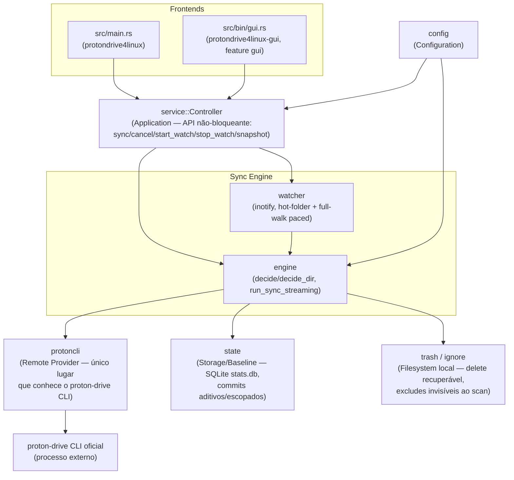

# Architecture Principles

## Objetivo do produto

Transformar o protondrive4linux num cliente Linux completo para Proton Drive, com experiência
comparável a Google Drive, OneDrive e Dropbox — sem nunca reimplementar autenticação ou
criptografia por conta própria (isso é delegado ao `proton-drive` CLI oficial da Proton).

## Princípio de priorização

1. Integridade dos dados
2. Segurança da supply chain
3. Compatibilidade Linux
4. Performance
5. Novas funcionalidades

Nenhuma nova funcionalidade deve comprometer uma camada anterior. Isto é o critério de
desempate para toda decisão de escopo em `docs/roadmap/`.

## Decisões de contexto (não revisitar sem justificativa explícita)

- **Base do fork**: [`WilhelmZA/protondrive_linux_sync`](https://github.com/WilhelmZA/protondrive_linux_sync)
  ("NeutronSync"), branch `rust`. Rebrand completo para **protondrive4linux** concluído
  (binários, config path, env var, systemd units, ícone/paleta — ver `CHANGELOG.md`).
- **Motor oficial**: todo acesso ao Proton Drive passa pelo `proton-drive` CLI oficial. O fork
  não reimplementa auth nem cripto — isso invalida por princípio qualquer proposta de "cofre
  criptografado do zero" (ver `docs/roadmap/M6-encrypted-vault.md`).
- **Sem FUSE/rclone no core**: o produto de curto/médio prazo é "pasta local sincronizada"
  (modelo Dropbox clássico). Mount FUSE ou qualquer coisa que dependa de hidratação sob demanda
  (placeholders online-only) fica fora do escopo principal (ver
  `docs/roadmap/M8-cloud-features.md`).
- **Alvo de empacotamento primário**: Arch Linux / AUR.

## Limitações conhecidas do CLI oficial

Não são bugs do fork — são o chão da casa. Qualquer feature nova precisa checar esta lista antes
de virar issue com critério de aceite:

- Sem change feed (`docs/SYNC_MODEL.md`) — a única forma de saber que algo mudou do lado remoto
  é listar de novo e comparar.
- Sem listagem recursiva nativa — o fork caminha a árvore remota pasta por pasta.
- Sem rename/move atômico no servidor (`src/protoncli.rs`: `"rename/move not supported by this
  backend"`) — um rename detectado por conteúdo ainda vira upload+delete do lado remoto.
- Sem comando de busca.
- Sem histórico de versão.
- Sem criação de link de compartilhamento (só lista o que já foi compartilhado por terceiros).

## Limites de módulo (`src/lib.rs`)

Mapeamento entre a arquitetura conceitual (GUI / CLI / Application / Sync Engine / Filesystem /
Remote Provider / Storage / Security / Configuration) e os módulos reais:

| Camada conceitual | Módulo(s) |
| --- | --- |
| Configuration | `config` |
| Remote Provider | `protoncli` — **o único** lugar que conhece specifics do `proton-drive` CLI (flags, invocação, parsing de output) |
| Sync Engine | `engine` — classificador three-way-merge (`decide`/`decide_dir`), full-walk streaming (`run_sync_streaming`) |
| Storage / Baseline | `state` — persistência SQLite (`stats.db`, tabela `baseline`), commits aditivos/escopados, nunca uma reescrita completa do par |
| Filesystem (local) | `watcher` (inotify, `notify-debouncer-full`), `trash` (delete recuperável), `ignore` (excludes nunca listados/baixados/deletados) |
| Application | `service::Controller` — a API sobre a qual CLI e GUI são construídos; comandos não-bloqueantes (`sync`, `cancel`, `start_watch`, `stop_watch`), `snapshot()` pra render, eventos do engine como `AppState` observável (`docs/GUI_API.md`) |
| CLI | `src/main.rs` — wrapper fino sobre a lib |
| GUI | `src/bin/gui.rs` (feature `gui`) — thin sobre `service::Controller`; **não** depende do CLI do Proton diretamente |
| Security (auditoria) | permissões de arquivo (`0700`/`0600` em `state_dir`/config), resolução do binário `proton-drive` — ver `SECURITY_AUDIT.md` |
| Supporting | `models`, `events`, `stats`, `datefmt`, `logger`, `auth_signal`, `updater` (feature `gui`) |

O critério de aceite mais importante de M0-001 já está satisfeito: a GUI não depende do CLI do
Proton diretamente, e o Sync Engine não conhece detalhes da GUI.

## Diagrama arquitetural (M0-001)

Setas mostram dependência (A → B = "A chama B"), não fluxo de dados. Note que `GUI`/`CLI` só
falam com `Controller`, nunca com `engine` ou `protoncli` diretamente — é a garantia que M0-001
pede.

## Sync Plan vs. Sync Execution (M0-002)

A separação `SCAN → PLAN → EXECUTE → VERIFY → COMMIT` já existe no código, só não estava
nomeada assim. Não é um refactor pendente — é preciso reconhecer o que já está lá:

| Fase | Onde | O que garante |
| --- | --- | --- |
| **SCAN** | `run_sync`/`run_sync_streaming`: lista local, lista remoto, lê baseline | Produz os três conjuntos de entradas que tudo abaixo consome |
| **PLAN** | `classify()` + `decide()`/`decide_dir()` → `Plan { ops: Vec<Op> }` (`models.rs`) | Função pura sobre os três conjuntos — nenhuma I/O acontece aqui. `Plan`/`Op` já são um tipo explícito, não uma lista de side-effects |
| **EXECUTE** | O loop que consome `plan.ops` (uploads/mkdirs/conflitos sequenciais + pool concorrente de downloads) | Cada `Op` vira uma chamada real ao `protoncli`/filesystem |
| **VERIFY** | `apply_op(...) -> Result<()>` | Sucesso/falha por operação — nada é assumido |
| **COMMIT** | Bookkeeping `pending`/`done`: uma baseline row provisória (criada em PLAN) só sobrevive se sua op estiver em `done` | Isto é o commit por confirmação positiva citado no `README.md`/`docs/SYNC_MODEL.md` |

O que falta de fato (ver `docs/roadmap/M1-data-integrity.md` M1-002) é só formalizar
"operação parcialmente executada pode ser retomada" como garantia testada — hoje é consequência
do design (uma op que falha simplesmente não entra em `done`, e a próxima run a re-detecta), mas
não há teste que documente isso como contrato explícito.

Ver `docs/architecture/SYNC_STATE_MATRIX.md` (M0-003) para a tabela completa de decisão do PLAN.
